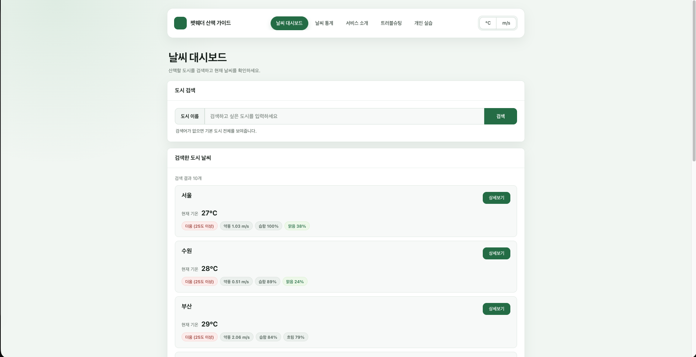

# SKALA Weather Vue App

## 프로젝트 소개

Vue.js 단계별 실습을 하나의 날씨 애플리케이션으로 확장한 프로젝트입니다. 국내 도시의 날씨와 대기질 데이터를 분석해 반려견과 산책하기 좋은 시간대를 안내합니다.

## 배포

- [SKALA Weather 서비스 바로가기](https://skala-vue-ecru-two.vercel.app/)

## 서비스 화면

## Final 결과물 설명

1차부터 7차까지 진행한 Vue 실습의 요구사항을 하나의 서비스에 순차적으로 적용했습니다. Mock 데이터로 시작한 날씨 화면을 컴포넌트와 페이지 단위로 분리하고, Vue Router와 Pinia를 연결한 뒤 실제 외부 API와 Element Plus UI를 적용했습니다.

최종 결과물에서는 도시의 현재 날씨만 보여주는 데 그치지 않고 기온, 강수, 바람과 대기질을 함께 분석합니다. 이를 바탕으로 현재 산책 환경을 점수로 표시하고 오늘 남은 시간과 내일 오전 중 반려견과 산책하기 좋은 시간대를 추천합니다.

평가 시 다음 페이지에서 주요 구현 결과를 확인할 수 있습니다.

- `/`: 도시 검색과 현재 날씨 목록
- `/weather/:cityId`: 도시별 날씨·대기질·산책 가이드 상세 정보
- `/stats`: 도시별 날씨 통계
- `/about`: 서비스 소개와 사용 기술
- `/troubleshooting`: 개발 과정의 문제와 해결 내용
- `/personal-practice`: 비동기 처리 개인 학습 기록

## 주요 기능

- 등록된 4개 도시의 현재 날씨 조회 및 검색
- 도시별 상세 날씨와 시간대별 예보 조회
- PM2.5·PM10·US AQI 대기질 정보 표시
- 현재 환경을 반영한 반려견 산책 점수 계산
- 오늘 남은 시간과 내일 오전의 산책 추천 시간 제공
- 로딩, 빈 결과와 API 오류 상태 안내

## 추가 기능

- 섭씨,화씨와 `m/s`,`km/h` 단위 변경
- 도시별 평균 기온·습도·풍속과 최고·최저 기온 통계
- `Promise.allSettled`를 이용한 API 부분 실패 처리
- Element Plus를 활용한 카드, 태그, 진행률과 상태 UI 구성
- 트러블슈팅 카드를 공통 컴포넌트로 분리해 재사용
- 개인 학습 페이지에서 비동기 처리 방식과 적용 이유 정리

## 프로젝트 구조

전체 소스 구조는 `src/` 디렉터리에서 확인할 수 있습니다.

- 재사용 컴포넌트: `src/components/`
- 페이지 컴포넌트: `src/views/`
- 라우팅 규칙: `src/router/index.js`
- Pinia Store: `src/stores/`
- 서비스 설명과 사용 기술: `/about`

## 과제 수행 사항

### 1차 실습: Weather Mockup

- `v-for`와 `:key`를 이용해 도시별 날씨 카드 반복 출력
- `v-if`를 이용해 기온에 따른 상태 표시
- 입력값 바인딩과 클릭 이벤트 구현
- 추가 구현: 습도, 구름량, 풍속과 경주 데이터 추가

### 2차 실습: Weather Composition

- 검색어, 선택된 도시와 날씨 목록을 반응형 상태로 관리
- `filteredWeatherList` Computed로 검색 결과 계산
- `watch`와 `watchEffect`로 선택 도시와 검색어 변화 감시
- 추가 구현: 검색어 초기화와 검색 추천 목록 구현

### 3차 실습: Weather Component

- 화면을 공통 카드, 검색창과 날씨 카드 컴포넌트로 분리
- Props와 Emits로 부모·자식 컴포넌트 연결
- `BaseDashboardCard`에 Default Slot 적용
- 추가 구현: 트러블슈팅 UI를 `TroubleshootingCard`로 분리해 재사용

### 4차 실습: Weather Router

- Vue Router의 지연 로딩과 Catch-all Route 적용
- `RouterLink`와 `RouterView`로 페이지 이동 구성
- 동적 경로 `/weather/:cityId`를 이용한 도시 상세 페이지 구현
- 추가 구현: 날씨 통계, 트러블슈팅과 개인 실습 View 추가

### 5차 실습: Weather Store

- Pinia의 State, Getter와 Action으로 온도 단위 관리
- 메인과 상세 페이지에 섭씨·화씨 변환 적용
- 추가 구현: 풍속 단위를 `m/s`와 `km/h`로 변경하는 상태와 기능 추가
- 선택 도시 상태를 Store로 관리해 상세 페이지 이동 후에도 선택 유지
- 외부 API 적용 후 날씨와 상세 데이터는 `weatherStore`로 분리

### 6차 실습: Axios와 외부 API

Axios를 이용해 Mock 데이터를 실제 날씨 데이터로 교체했습니다. API 요청은 `src/api/index.js`, 데이터 상태와 응답 처리는 `src/stores/weatherStore.js`에서 관리합니다.

| 제공자      | API                         | 활용 내용                        |
| ----------- | --------------------------- | -------------------------------- |
| OpenWeather | Current Weather API         | 현재 기온·습도·풍속·구름량 조회  |
| OpenWeather | 5 Day / 3 Hour Forecast API | 오늘과 내일의 시간대별 예보 조회 |
| Open-Meteo  | Air Quality API             | PM2.5·PM10·US AQI 조회           |

날씨와 대기질을 조합해 100점 기준의 산책 점수를 계산하고 다음 정보를 표시합니다.

- 현재 환경의 산책 점수
- 오늘 남은 시간 중 가장 좋은 시간
- 내일 오전 6시부터 12시 중 가장 좋은 시간

일부 요청이 실패해도 성공한 데이터를 계속 표시할 수 있도록 기본 도시와 상세 데이터 요청에 `Promise.allSettled`를 적용했습니다.

### 7차 실습: Element Plus

일반 HTML 중심의 화면을 Element Plus 컴포넌트 기반으로 변경했습니다.

| 컴포넌트                               | 적용 내용                                |
| -------------------------------------- | ---------------------------------------- |
| `ElCard`, `ElTag`                      | 날씨·통계·상태 정보를 카드와 태그로 표시 |
| `ElInput`, `ElButton`, `ElButtonGroup` | 도시 검색과 단위 변경 기능 제공          |
| `ElSkeleton`, `ElEmpty`, `ElAlert`     | 로딩·빈 결과·API 실패 상태 안내          |
| `ElProgress`                           | 산책 점수를 진행률로 시각화              |
| `ElLink`                               | 개인 실습 페이지의 참고 자료 연결        |

## 개인 학습 기록

`/personal-practice` 페이지에서 `Promise.all`과 `Promise.allSettled`의 차이와 현재 프로젝트에 `Promise.allSettled`를 적용한 이유를 정리했습니다.

### 참고한 자료

- [MDN Web Docs - Promise.all()](https://developer.mozilla.org/ko/docs/Web/JavaScript/Reference/Global_Objects/Promise/all)
- [MDN Web Docs - Promise.allSettled()](https://developer.mozilla.org/ko/docs/Web/JavaScript/Reference/Global_Objects/Promise/allSettled)
- [Promise.allSettled 와 Promise.all 비교 정리](https://inpa.tistory.com/entry/JS-%F0%9F%93%9A-%EB%8D%94%EC%9D%B4%EC%83%81-Promiseall-%EC%93%B0%EC%A7%80%EB%A7%90%EA%B3%A0-PromiseallSettled-%EC%82%AC%EC%9A%A9%ED%95%98%EC%9E%90)

## 트러블슈팅

개발 과정에서 발생한 문제와 해결 과정은 `/troubleshooting` 페이지에서 확인할 수 있습니다.

## API 문서

- [OpenWeather Current Weather API](https://openweathermap.org/current)
- [OpenWeather 5 Day / 3 Hour Forecast API](https://openweathermap.org/forecast5)
- [Open-Meteo Air Quality API](https://open-meteo.com/en/docs/air-quality-api)
